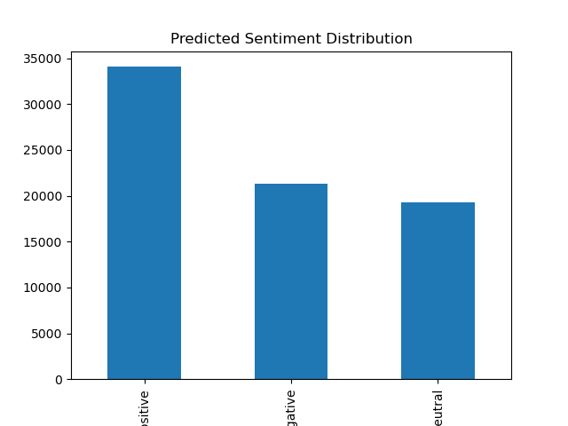
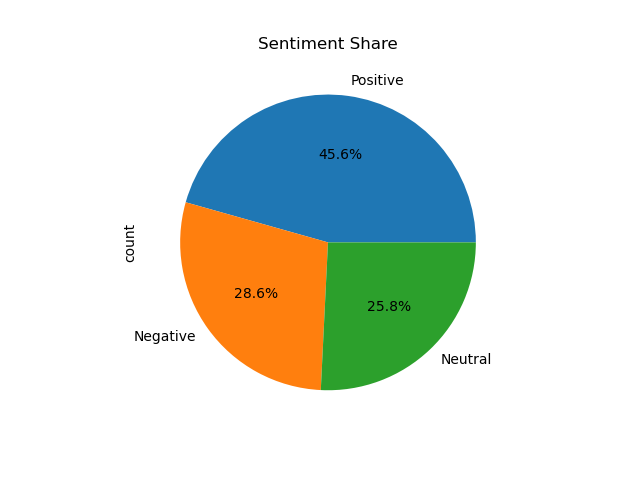

# PRODIGY_DS_04

## 📌 Internship Track
Data Science Internship at Prodigy InfoTech

---

## 📊 Task Objective
To analyze and visualize sentiment patterns in social media data to understand public opinion and attitudes towards specific topics.

---

## 📁 Dataset
Social Media Sentiment Dataset (Provided by Prodigy InfoTech)

The dataset contains:
- Tweet ID
- Topic / Brand
- Original Sentiment (Positive / Negative / Neutral)
- Tweet text

---

## 🧹 Data Preprocessing

- Loaded dataset using Pandas
- Assigned appropriate column names
- Handled text data for analysis
- Prepared dataset for sentiment evaluation

---

## 🧠 Sentiment Analysis

- Used **TextBlob** for sentiment analysis
- Generated a new column:
  - **Predicted_Sentiment**

---

## 📈 Exploratory Analysis

Performed analysis on:
- Predicted sentiment distribution
- Original sentiment distribution

---

## 📊 Visualizations

### 🔹 Sentiment Distribution (Bar Chart)

### 🔹 Sentiment Share (Pie Chart)

---

## 🔍 Key Insights

- Majority of tweets were classified as **Neutral** by TextBlob  
- Differences observed between actual and predicted sentiments  
- Basic sentiment models may struggle with informal or domain-specific text  

---

## 🛠 Tools & Technologies

- Python  
- Pandas  
- TextBlob  
- Matplotlib  

---

## 📂 Project Structure

PRODIGY_DS_04/

│

├── data/

│ └── tweets.csv

│

├── notebooks/

│ └── task4_sentiment_analysis.ipynb

│

├── outputs/

│ ├── sentiment_distribution.png

│ └── sentiment_pie.png

│

└── README.md

---

## ✅ Conclusion

This project demonstrates how sentiment analysis can be applied to social media data to understand public opinion. It also highlights the limitations of basic sentiment analysis tools when working with informal text data.

---

## 👤 Author
Gokul S
